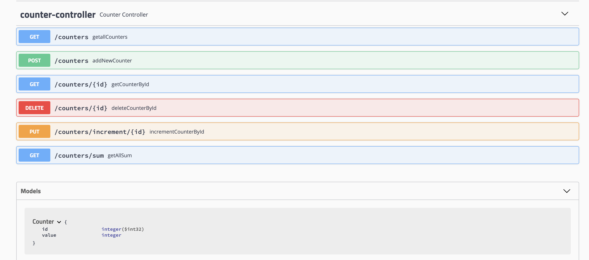

# Counter REST API

## Run
```
docker-compose up
```

## API documentation
[](https://github.com/kukinpower/counter-api/actions/workflows/maven.yml)

### [http://localhost:8080/swagger-ui.html](http://localhost:8080/swagger-ui.html)



Author: Roman Kukin
